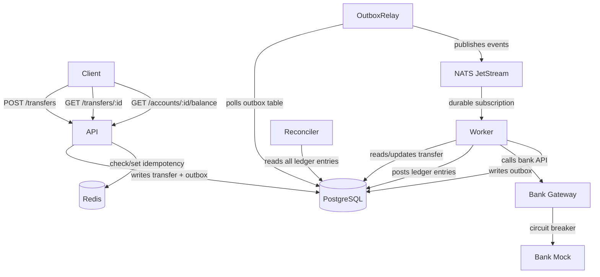
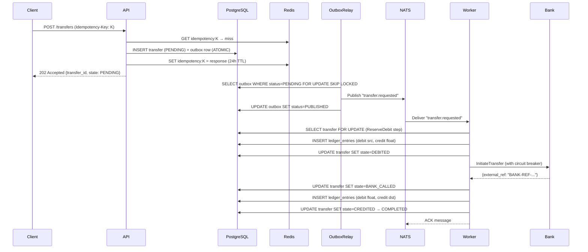

# Architecture

## Overview

`flip-style-transfer-engine` implements an interbank money transfer service using four independently deployable binaries, all coordinated through PostgreSQL (source of truth), NATS JetStream (event bus), and Redis (idempotency).

## Component Diagram



## Sequence: Happy-Path Transfer



## Transactional Outbox Pattern

The API and Worker never write directly to NATS. Instead:

1. **Business write** (INSERT transfer) and **event intent** (INSERT outbox) are committed in the same DB transaction.
2. The **OutboxRelay** polls the outbox table with `FOR UPDATE SKIP LOCKED` and publishes to NATS.
3. Only after NATS confirms delivery is the outbox row marked `PUBLISHED`.

This guarantees that a process crash between step 1 and step 2 will never lose an event — the relay will republish on restart.

## SAGA Orchestration

The `TransferSaga` is stateless and resumable. The transfer's `state` column in PostgreSQL is the single source of truth for where in the saga we are. The worker can crash and restart at any step — `Execute()` resumes from the current state.

```
PENDING → ReserveDebit → DEBITED
DEBITED → CallBankAPI → BANK_CALLED
BANK_CALLED → PostCredit → CREDITED
CREDITED → CompleteTransfer → COMPLETED

On failure at any step:
→ COMPENSATING → (reverse posted entries) → FAILED
```

## Double-Entry Ledger Invariants

1. Every posting creates exactly 2 entries: one DEBIT, one CREDIT.
2. The signed sum of all entries always equals zero per currency.
3. Entries are immutable — corrections use reversing entries.
4. Balance is always `SUM(signed_amount WHERE account_id = X)` — never a cached column.

## Circuit Breaker

Bank calls are wrapped in a circuit breaker (3-state: CLOSED → OPEN → HALF_OPEN):
- Opens after 5 consecutive failures.
- Resets after 30 seconds.
- In OPEN state, calls fail fast with `ErrCircuitOpen` — the saga compensates immediately.
